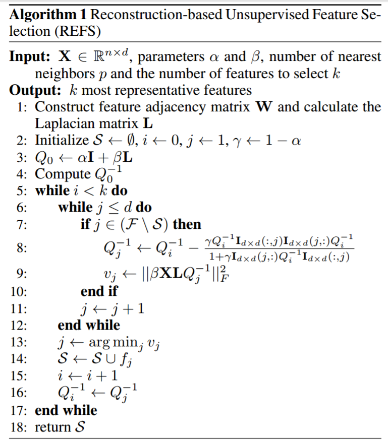

# REFS
In this project I implemented "Reconstruction-based Unsupervised Feature Selection" method for feature selection. This method selects the features which other features could be constructed using selected ones properly.

here is the implemented algorithm.

[here](https://pdfs.semanticscholar.org/1257/236ec8b7a21afe7305abac0e6b0cafc3752f.pdf) is the original paper.
array([200., 926., 962.,  43., 877.])